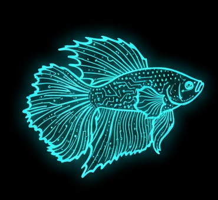

# BETTA HA Panel 
A runtime configurable Home Assistant dashboard for the ESP32-P4 Smart 86 Box development board.

## Projektbeschreibung
BETTA HA Panel turns the Smart86 Box into a standalone 720x720 Home Assistant wall panel. It is built for a dedicated touchscreen experience with fast access to your most important entities, scenes, and automations.

The dashboard is configured directly on the device via the integrated BETTA Editor. Layout and settings are stored as JSON in LittleFS, so you can iterate quickly without rebuilding firmware for every UI change.

- Live connection to Home Assistant via WebSocket (optionally with REST fallback)
- Local web editor at `http://<panel-ip>` for layout, widgets, and settings
- Integrated provisioning flow for Wi-Fi and Home Assistant (including the setup AP `BETTA-Setup`)
- Multi-page widget dashboard, e.g., sensor, button, slider, graph, light, heating, and weather tiles
- Subtle Lottie-animated weather icons for a more dynamic forecast view

A few examples:

  
  

Configuration via webconfig in BETTA Editor:

available Widgets:

Widgets can be configured and placed (drag and drop) on the canvas:

